# AI 海龟汤

利用AI 生产海龟汤故事，和用户交互式的响应，让用户去解密。

海龟汤游戏介绍 [海龟汤概论 - 知乎](https://zhuanlan.zhihu.com/p/37072206)

利用AI 当作主持人，给出”汤面“，让用户去猜情景。AI 只能回复用户 `是 或者 不是`，10次提问后就给出“汤底”。

# 需求分析

* AI 生产“汤面和汤底” P0
* 用户和AI交互    P0
* 查看往期对话  P1
* 用户可以分享本次的海龟汤  P2

# 原型图


# 技术

* SpringBoot
* Mysql
* Mybatis
* DeepSeek
* Vue

# 核心功能梳理

1. 利用AI (主持人)生成海龟汤-> 输出给用户
2. 用户根据“汤面” ----> 询问问题或者给出答案
3. AI (主持人)对于用户的问题只能回答 是或者不是
4. 10条询问后还没有用户还没有猜出“汤底”，AI (主持人)给出“汤底”，并结束游戏
5. 或者用户猜出了答案，AI (主持人) 提示猜对了，并且给出“汤底”
6. 或者用户说出不想玩了，AI (主持人) 并且给出“汤底，并结束游戏”


# 项目初初始化

spring boot

mysql

mybaits

web

Knife4j


# 接入 AI

记录一下选择的模型


官方demo 引入测试


1. 引入依赖

```xml
       <!--        AI 接入 火山引擎 Deepseek https://www.volcengine.com/experience/ark-->
        <dependency>
            <groupId>com.volcengine</groupId>
            <artifactId>volcengine-java-sdk-ark-runtime</artifactId>
            <version>0.1.153</version>
        </dependency>
```

2. 创建apikey 并且使用官方demo 测试是否引入成功

```java
package com.ls.ai;

import com.volcengine.ark.runtime.model.completion.chat.ChatCompletionRequest;
import com.volcengine.ark.runtime.model.completion.chat.ChatMessage;
import com.volcengine.ark.runtime.model.completion.chat.ChatMessageRole;
import com.volcengine.ark.runtime.service.ArkService;
import okhttp3.ConnectionPool;
import okhttp3.Dispatcher;

import java.util.ArrayList;
import java.util.List;
import java.util.concurrent.TimeUnit;
public class AiTest {
    // 从环境变量中获取您的 API Key。此为默认方式，您可根据需要进行修改
       static String apiKey = "你的apikey";
    // 此为默认路径，您可根据业务所在地域进行配置
    static String baseUrl = "https://ark.cn-beijing.volces.com/api/v3";
    static ConnectionPool connectionPool = new ConnectionPool(5, 1, TimeUnit.SECONDS);
    static Dispatcher dispatcher = new Dispatcher();
    static ArkService service = ArkService.builder().dispatcher(dispatcher).connectionPool(connectionPool).baseUrl(baseUrl).apiKey(apiKey).build();

    public static void main(String[] args) {
        System.out.println("\n----- standard request -----");
        final List messages = new ArrayList<>();
        final ChatMessage systemMessage = ChatMessage.builder().role(ChatMessageRole.SYSTEM).content("你是人工智能助手.").build();
        final ChatMessage userMessage = ChatMessage.builder().role(ChatMessageRole.USER).content("常见的十字花科植物有哪些？").build();
        messages.add(systemMessage);
        messages.add(userMessage);

        ChatCompletionRequest chatCompletionRequest = ChatCompletionRequest.builder()
                // 指定您创建的方舟推理接入点 ID，此处已帮您修改为您的推理接入点 ID
                .model("doubao-lite-128k-240828")
                .messages(messages)
                .build();

        service.createChatCompletion(chatCompletionRequest).getChoices().forEach(choice -> System.out.println(choice.getMessage().getContent()));

        System.out.println("\n----- streaming request -----");
        final List streamMessages = new ArrayList<>();
        final ChatMessage streamSystemMessage = ChatMessage.builder().role(ChatMessageRole.SYSTEM).content("你是人工智能助手.").build();
        final ChatMessage streamUserMessage = ChatMessage.builder().role(ChatMessageRole.USER).content("常见的十字花科植物有哪些？").build();
        streamMessages.add(streamSystemMessage);
        streamMessages.add(streamUserMessage);

        ChatCompletionRequest streamChatCompletionRequest = ChatCompletionRequest.builder()
                // 指定您创建的方舟推理接入点 ID，此处已帮您修改为您的推理接入点 ID
                .model("doubao-lite-128k-240828")
                .messages(messages)
                .build();

        service.streamChatCompletion(streamChatCompletionRequest)
                .doOnError(Throwable::printStackTrace)
                .blockingForEach(
                        choice -> {
                            if (choice.getChoices().size() > 0) {
                                System.out.print(choice.getChoices().get(0).getMessage().getContent());
                            }
                        }
                );

        service.shutdownExecutor();
    }

}

```

测试： 如下引入成功

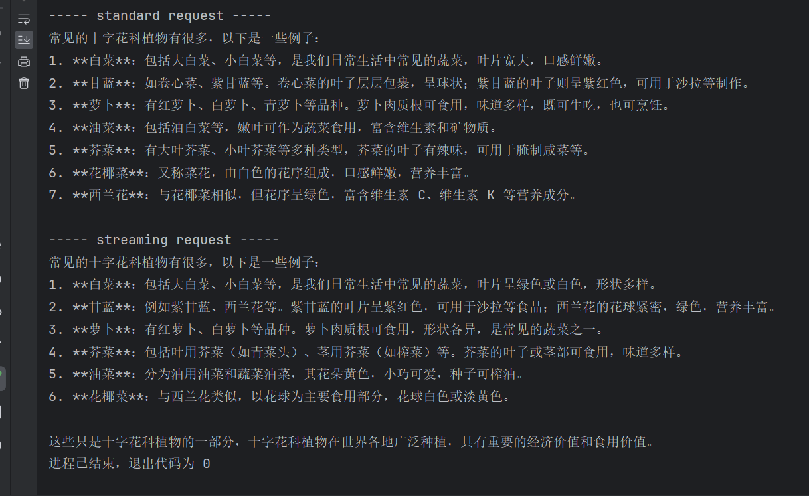


# 编写AI 工具类

上述官方demo的核心

1. 获取AI服务

```java
    static String apiKey = "你的apikey";
    // 此为默认路径，您可根据业务所在地域进行配置
    static String baseUrl = "https://ark.cn-beijing.volces.com/api/v3";
    static ConnectionPool connectionPool = new ConnectionPool(5, 1, TimeUnit.SECONDS);
    static Dispatcher dispatcher = new Dispatcher();
    static ArkService service = ArkService
            .builder().dispatcher(dispatcher)
            .connectionPool(connectionPool)
            .baseUrl(baseUrl)
            .apiKey(apiKey).build();
```

2. 构造消息

这一步应该我们用户去输入

```java
  // 构造消息
        final List messages = new ArrayList<>();
        final ChatMessage systemMessage = ChatMessage.builder().role(ChatMessageRole.SYSTEM).content("你是人工智能助手.").build();
        final ChatMessage userMessage = ChatMessage.builder().role(ChatMessageRole.USER).content("常见的十字花科植物有哪些？").build();
        messages.add(systemMessage);
        messages.add(userMessage);
```

3.构造请求（传入消息，并且指定模型）

```java
      ChatCompletionRequest chatCompletionRequest = ChatCompletionRequest.builder()
                // 指定您创建的方舟推理接入点 ID，此处已帮您修改为您的推理接入点 ID
                .model("doubao-lite-128k-240828")
                .messages(messages)
                .build();

```

4. 发起请求，并且获得结果

```java
    // 发起请求 并解析结果
        service.createChatCompletion(chatCompletionRequest)
                .getChoices()
                .forEach(choice -> System.out.println(choice.getMessage().getContent()));
```

了解上述，我们可以编写工具类，更好的调用AI服务（我们只关注，我们传入的参数）

> 编写AI 工具类

1.编写AI配置类 ---->定义一些我们ai服务的参数，获取到AI服务

```java
/**
 * AI 配置类
 */
@Configuration
@ConfigurationProperties(prefix = "ai")
@Data// 因为springboot 参数的注入是直接setter 方法的，所以要加@Data
public class Aiconfig {

    private  String apikey;

    static String baseUrl = "https://ark.cn-beijing.volces.com/api/v3";

    static ConnectionPool connectionPool = new ConnectionPool(5, 1, TimeUnit.SECONDS);
    static Dispatcher dispatcher = new Dispatcher();

    @Bean
    public ArkService getAIService() {
        return ArkService.builder().dispatcher(dispatcher)
                .connectionPool(connectionPool)
                .baseUrl(baseUrl)
                .apiKey(apikey).build();
    }
}

```

测试一下，有没有生效

搞了半小时，一直获取不到key。

获取不到key 的排查思路

1. 配置文件和java类apiKey 是否对应
2. 启动项目时是否指定环境

比如说我的apiKey在application-local.yaml文件，所以我启动项目(或者测试类)的时候也要指定启动的配置文件也就是环境。

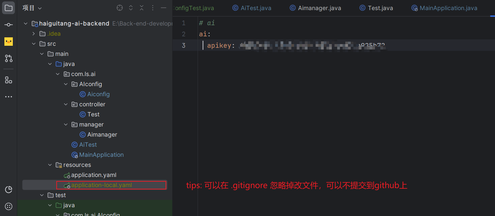

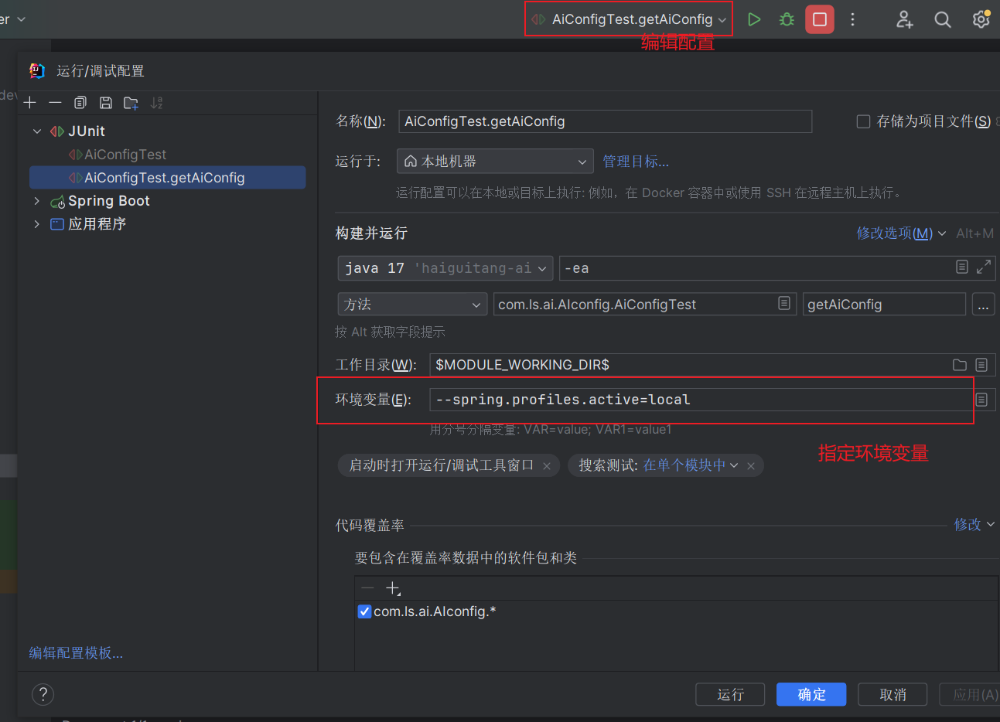

3. 坚持配置类是否获取到配置文件中的信息。（一定要写set方法，我就是因为没有set方法，导致一直获取不到apikey）

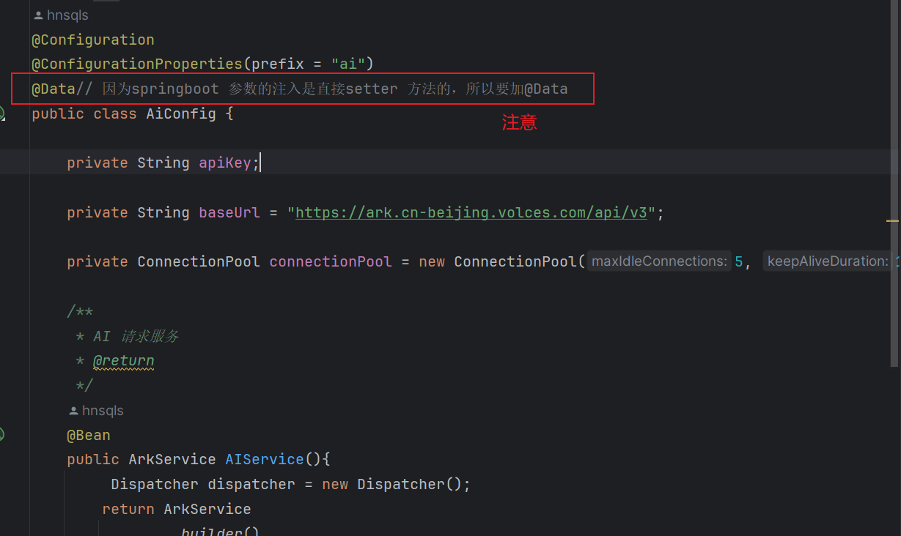

测试通过

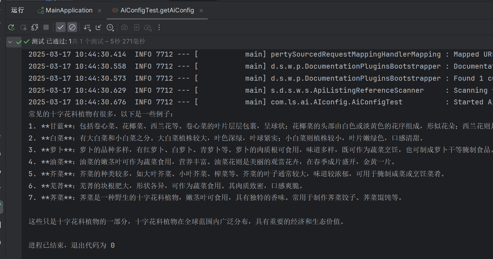

> AI工具类

上述我们已经拿到，AI服务了，为了更方便的使用，我们仅需要输入用户信息，而不关心其他。

```java
/**
 * Ai 工具类
 */
@Component
public class Aimanager {

    @Resource
    private ArkService aiService;


    /**
     * AI 默认模型 Doubao-lite-128k  240828
     */
    private  String Default_Model= "doubao-lite-128k-240828";


    /**
     * 用户输入
     * @param userPrompt
     * @return
     */
    public String doChat(String userPrompt) {
        System.out.println("\n----- standard request -----");

        // 构造消息
        final List<ChatMessage> messages = new ArrayList<>();
        final ChatMessage systemMessage = ChatMessage.builder().role(ChatMessageRole.SYSTEM).content("").build();
        final ChatMessage userMessage = ChatMessage.builder().role(ChatMessageRole.USER).content(userPrompt).build();
        messages.add(systemMessage);
        messages.add(userMessage);


        // 构造请求
        ChatCompletionRequest chatCompletionRequest = ChatCompletionRequest.builder()
                // 指定您创建的方舟推理接入点 ID，此处已帮您修改为您的推理接入点 ID
                .model(Default_Model)
                .messages(messages)
                .build();
//        发起请求 并解析结果
        List<ChatCompletionChoice> choices = aiService.createChatCompletion(chatCompletionRequest).getChoices();

        if (choices == null || choices.isEmpty()) {
            throw new RuntimeException("AI生成失败");
        }

        // 解析结果
        StringBuilder stringBuilder = new StringBuilder();
        choices.forEach(choice -> stringBuilder.append(choice.getMessage().getContent()).append("\n"));
        return stringBuilder.toString();

    }


    /**
     * 系统输入 用户输入
     * @param systemPrompt
     * @param userPrompt
     * @return
     */
    public String doChat(String systemPrompt,String userPrompt) {
        System.out.println("\n----- standard request -----");

        // 构造消息
        final List<ChatMessage> messages = new ArrayList<>();
        final ChatMessage systemMessage = ChatMessage.builder().role(ChatMessageRole.SYSTEM).content(systemPrompt).build();
        final ChatMessage userMessage = ChatMessage.builder().role(ChatMessageRole.USER).content(userPrompt).build();
        messages.add(systemMessage);
        messages.add(userMessage);


        // 构造请求
        ChatCompletionRequest chatCompletionRequest = ChatCompletionRequest.builder()
                // 指定您创建的方舟推理接入点 ID，此处已帮您修改为您的推理接入点 ID
                .model(Default_Model)
                .messages(messages)
                .build();
//        发起请求 并解析结果
        List<ChatCompletionChoice> choices = aiService.createChatCompletion(chatCompletionRequest).getChoices();

        if (choices == null || choices.isEmpty()) {
            throw new RuntimeException("AI生成失败");
        }

        // 解析结果
        StringBuilder stringBuilder = new StringBuilder();
        choices.forEach(choice -> stringBuilder.append(choice.getMessage().getContent()).append("\n"));
        return stringBuilder.toString();

    }


    /**
     * 系统输入、用户输入，用户指定模型
     * @param systemPrompt
     * @param userPrompt
     * @param AiModel
     * @return
     */
    public String doChat(String systemPrompt, String userPrompt,String AiModel){


        System.out.println("\n----- standard request -----");
        // 构造消息
        final List<ChatMessage> messages = new ArrayList<>();
        final ChatMessage systemMessage = ChatMessage.builder().role(ChatMessageRole.SYSTEM).content(systemPrompt).build();
        final ChatMessage userMessage = ChatMessage.builder().role(ChatMessageRole.USER).content(userPrompt).build();
        messages.add(systemMessage);
        messages.add(userMessage);


        // 封装请求
        ChatCompletionRequest chatCompletionRequest = ChatCompletionRequest.builder()
                // 指定您创建的方舟推理接入点 ID，此处已帮您修改为您的推理接入点 ID
                .model(AiModel)
                .messages(messages)
                .build();

        // 发起请求获取结果
        List<ChatCompletionChoice> choices = aiService.createChatCompletion(chatCompletionRequest).getChoices();

        if (choices == null || choices.isEmpty()) {
            throw  new RuntimeException("AI生成失败");
        }

        // 解析结果
        StringBuilder stringBuilder = new StringBuilder();
        choices.forEach(choice -> stringBuilder.append(choice.getMessage().getContent()).append("\n"));

        return stringBuilder.toString();
    }
}

```

测试

```java
@SpringBootTest
class AimanagerTest {


    @Resource
    private Aimanager aimanager;
    @Test
    void doChat() {
        String string = aimanager.doChat("你是谁");
        System.out.println("AI 回复 = " + string);
    }
}
```

没问题

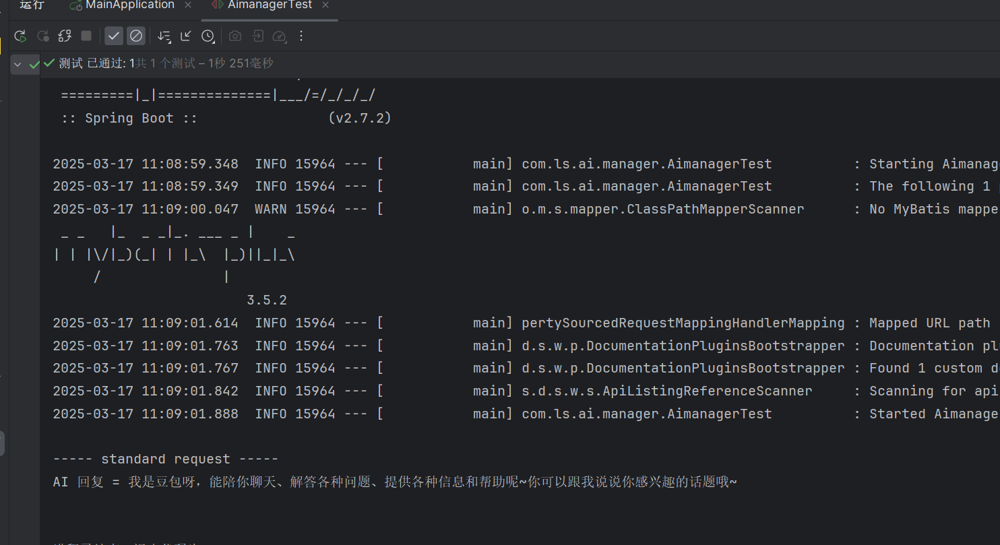

9 -10 -11  2个小时搞到这个，全部自己从0零搭建。加油吧


# 编写Prompt

实现AI 生成“海龟汤”故事，并且，最先只输出一段场景，然后根据用户的询问，回复是或者不是，最后在输出”汤面“

先写最简单的prompt ,让AI生成　海龟汤故事

```java
/**
     * 生成海龟汤
     */
    @Test
    void testDoChat() {

        String systemPrompt = "你是一个海龟汤游戏的主持人，请你生成故事";
        String string = aimanager.doChat(systemPrompt,"");
        System.out.println("string = " + string);
    }
```

测试

现在的AI 确实智能，仅用一行就理解了意思。

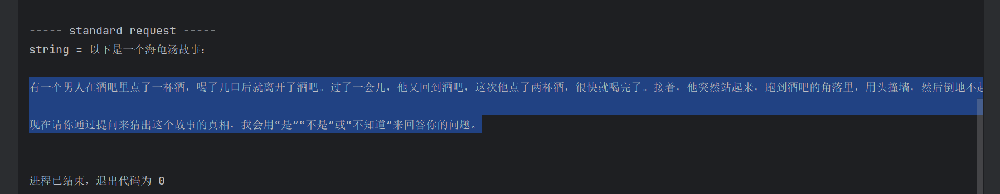

多次测试

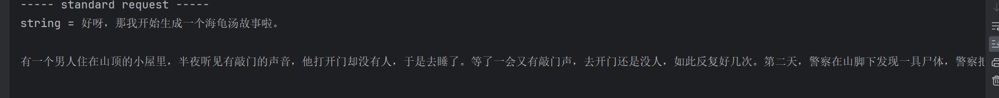

我们不要于故事无关的信息。 比如说，优化prompt

```java
       String systemPrompt ="""
        你是一个海龟汤游戏的主持人，请你生成故事
        要求
        1.故事要有逻辑性，要有悬念
        2.故事要符合海龟汤游戏的规则，要有答案
        3.在开头,输出请你还原事情真相
        """;
```

还可以

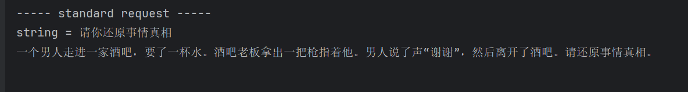

现在考虑，如何交互，让AI根据上下文

或许我可以直接在测试的时候输入呢

```java
 @Test
    void testDoChat() {

        String systemPrompt ="""
        你是一个海龟汤游戏的主持人，请你生成故事
        要求
        1.故事要有逻辑性，要有悬念
        2.故事要符合海龟汤游戏的规则，要有答案
        3.在开头,输出请你还原事情真相
        """;


        String string = aimanager.doChat(systemPrompt,"");
        System.out.println("string = " + string);

        Scanner scanner = new Scanner(System.in);

        for (int i= 0 ; i < 10 ; i++){
            String string1 = scanner.nextLine();
            System.out.println("用户 = " + string1);

            aimanager.doChat(systemPrompt,string1);

        }
    }
```

我是想直接先用输入，来测试，但是发现该视图不能输入

发现：

在 IntelliJ IDEA 中运行测试时，无法直接通过控制台输入数据的原因是 IDEA 的测试运行器默认不会打开交互式控制台。这会导致 `Scanner` 无法正常工作。

那只能在主环境中测试了。

在spring boot项目启动时执行

```java
package com.ls.ai;

import com.ls.ai.manager.Aimanager;
import org.springframework.boot.CommandLineRunner;
import org.springframework.stereotype.Component;

import javax.annotation.Resource;
import java.util.Scanner;

@Component
public class haiguitangTest implements CommandLineRunner {

    @Resource
    private Aimanager aimanager;

    @Override
    public void run(String... args) throws Exception {
        String systemPrompt = """
            你是一个海龟汤游戏的主持人，请你生成故事
            要求
            1.故事要有逻辑性，要有悬念
            2.故事要符合海龟汤游戏的规则，要有答案
            3.在开头,输出“请你还原事情真相”
            4.生成故事后，等待用户输入，根据用户输入提供提示或答案
            """;

        // 生成初始故事
        String story = aimanager.doChat(systemPrompt, "");
        System.out.println("AI生成的故事：\n" + story);

        Scanner scanner = new Scanner(System.in);

        for (int i = 0; i < 10; i++) {
             systemPrompt = """
            你是一个海龟汤游戏的主持人，故事已经生成过了，你现在引导用户玩游戏
            1.根据用户的输入，提示是或者不是
            2.用户表现出不想玩了，就给出答案
            3.生成故事后，等待用户输入，根据用户输入提供提示或答案
            4.不要生成多余内容
            """;
            System.out.print("用户请询问：");
            String userInput = scanner.nextLine();
            System.out.println("用户输入：" + userInput);

            // 根据用户输入获取 AI 的回复
            String aiResponse = aimanager.doChat(systemPrompt, userInput);
            System.out.println("AI回复：\n" + aiResponse);

            // 如果用户输入“退出”，结束循环
            if ("退出".equals(userInput)) {
                break;
            }
        }

        scanner.close();
    }
}
```


测试

```java
----- standard request -----
AI生成的故事：
请你还原事情真相
在一个偏僻的小镇上，有一座古老的城堡。每到夜晚，城堡中就会传出奇怪的哭声。一天，一个勇敢的冒险家来到了这个小镇，他决定去探索那座城堡，找出哭声的真相。当他走进城堡的大厅时，却发现地上有一滩血迹，而哭声似乎是从楼上传来的。请你还原事情真相。

用户请询问：冒险家死了吗
用户输入：冒险家死了吗

----- standard request -----
AI回复：
是

用户请询问：还有其他人吗
用户输入：还有其他人吗

----- standard request -----
AI回复：
不是

用户请询问：城堡里面有人吗
用户输入：城堡里面有人吗

----- standard request -----
AI回复：
是

用户请询问：有几个人
用户输入：有几个人

----- standard request -----
AI回复：
1 个人。

用户请询问：不想玩了
用户输入：不想玩了

----- standard request -----
AI回复：
答案：有一个男人下班回家，在地铁上看到一个穿白色连衣裙的长发女人，她一直盯着男人看，男人觉得很奇怪。第二天男人又在地铁上看到了那个女人，她还是盯着男人看。第三天男人在地铁上再次看到那个女人，他忍不住问女人为什么一直盯着他，女人说：“你的眼睛里有我。”男人低头一看，自己的眼睛里果然有那个女人的倒影。原来女人是一个精神病患者，她把男人的眼睛当成了镜子。

```

可以看出，ai没有获得上下文。 怎么获得上下文？或许可以每次都拼接之前的信息。可以尝试

```java
package com.ls.ai;

import com.ls.ai.manager.Aimanager;
import org.springframework.boot.CommandLineRunner;
import org.springframework.stereotype.Component;

import javax.annotation.Resource;
import java.util.Scanner;

@Component
public class haiguitangTest implements CommandLineRunner {

    @Resource
    private Aimanager aimanager;

    @Override
    public void run(String... args) throws Exception {
        String systemPrompt = """
            你是一个海龟汤游戏的主持人，请你生成故事
            要求
            1.故事要有逻辑性，要有悬念
            2.故事要符合海龟汤游戏的规则，要有答案
            3.在开头,输出“请你还原事情真相”
            4.不要生成多余内容
            """;

        // 生成初始故事
        String story = aimanager.doChat(systemPrompt, "");
        System.out.println("AI生成的故事：\n" + story);

        Scanner scanner = new Scanner(System.in);
		// 拼接信息
        StringBuilder gameContext = new StringBuilder();
        gameContext.append(story);
        for (int i = 0; i < 10; i++) {
             systemPrompt = """
            你是一个海龟汤游戏的主持人，故事已经生成过了会在用户的消息里拼接，但是用户并不知道，你现在引导用户玩游戏
            1.根据用户的输入，智能提示是或者不是
            2.用户表现出不想玩了，就给出答案
            3.生成故事后，等待用户输入，根据用户输入提供提示或答案
            4.不要生成多余内容
            """;
            System.out.print("用户请询问：");
            String userInput = scanner.nextLine();
            System.out.println("用户输入：" + userInput);

            // 拼接 用户 消息
            StringBuilder userContext = gameContext.append("用户输入：").append(userInput).append("\n");

            // 根据用户输入获取 AI 的回复
            String aiResponse = aimanager.doChat(systemPrompt, userContext.toString());
            System.out.println("AI回复：\n" + aiResponse);
            // 拼接 AI 消息
            gameContext.append("AI回复：").append(aiResponse).append("\n");

            // 如果用户输入“退出”，结束循环
            if ("退出".equals(userInput)) {
                break;
            }
        }

        scanner.close();
    }
}
```

还可以

```java
AI生成的故事：
请你还原事情真相
一个男人走进一家酒吧，要了一杯水。酒吧老板拿出一把枪指着他。男人说了声“谢谢”，然后离开了酒吧。请还原事情真相。

用户请询问：他们认识吗
用户输入：他们认识吗

----- standard request -----
AI回复：
认识

用户请询问：不想玩了
用户输入：不想玩了

----- standard request -----
AI回复：
男人因为喉咙卡了鱼刺等异物，非常难受，他到酒吧是想借水冲下去，但又无法准确表达自己的需求。酒吧老板看出他的异样，用枪指着他是为了吓唬他，让他把喉咙张开，男人领会了老板的意思，说了声“谢谢”，然后离开酒吧去处理喉咙里的异物了。
```


但是多次测试发现

```java
----- standard request -----
AI生成的故事：
请你还原事情真相
一个男人走进一家酒吧，向酒保要了一杯水。酒保拿出一把枪指着他。男人说了声“谢谢”，然后就离开了。请还原事情真相。

用户请询问：男人卡住喉咙了吗
用户输入：男人卡住喉咙了吗

----- standard request -----
AI回复：
不是

用户请询问：男人想死
用户输入：男人想死

----- standard request -----
AI回复：
不是

用户请询问：不想玩了
用户输入：不想玩了

----- standard request -----
AI回复：
酒保拿出枪是为了吓唬男人，让他把卡住喉咙的东西咳出来。男人要水是因为他喉咙卡住了难受，酒保用枪吓他后，他咳嗽出异物，感觉舒服了，所以说了声“谢谢”就离开了。

```

分析一下问题

debug，发现，一开始没有生成答案，导致之后，AI随便回复是或者否

我应该第一次直接让AI给出题目和答案，但是仅仅输出题目，答案我们存在字符串里给之后的调用AI服务，之后让AI根据我们的答案回复给用户是或者否，并且拼接用户和AI对话的信息，到最后输出答案。

修改系统prompt 让他生成故事同时生成答案， 我们对生成的字符串拆分，只输出故事。

```java
package com.ls.ai;

import com.ls.ai.manager.Aimanager;
import org.springframework.boot.CommandLineRunner;
import org.springframework.stereotype.Component;

import javax.annotation.Resource;
import java.util.Scanner;

@Component
public class haiguitangTest implements CommandLineRunner {

    @Resource
    private Aimanager aimanager;

    @Override
    public void run(String... args) throws Exception {
        String systemPrompt = """
            你是一个海龟汤游戏的主持人，请你生成故事，并且生成答案
            要求
            1.故事要有逻辑性，要有悬念
            2.故事要符合海龟汤游戏的规则，要有答案
            3.在开头,输出“请你还原事情真相”
            4.不要生成多余内容
            """;

        // 生成初始故事
        String story = aimanager.doChat(systemPrompt, "");
        // 处理生成的故事
        String[] split = story.split("答案");


        System.out.println("AI生成的故事：\n" + split[0]);

        Scanner scanner = new Scanner(System.in);

        StringBuilder gameContext = new StringBuilder();
        gameContext.append(story);
        for (int i = 0; i < 10; i++) {
             systemPrompt = """
            你是一个海龟汤游戏的主持人，故事已经生成过了会在用户的消息里拼接，但是用户并不知道，你现在引导用户玩游戏
            1.根据用户的输入以及答案内容，提示用户是或者不是
            2.用户表现出不想玩了，就给出答案
            3.根据用户输入提供提示或答案
            4.不要生成多余内容
            """;
            System.out.print("用户请询问：");
            String userInput = scanner.nextLine();
            System.out.println("用户输入：" + userInput);

            // 拼接 用户 消息
            StringBuilder userContext = gameContext.append("用户输入：").append(userInput).append("\n");

            // 根据用户输入获取 AI 的回复
            String aiResponse = aimanager.doChat(systemPrompt, userContext.toString());
            System.out.println("AI回复：\n" + aiResponse);
            // 拼接 AI 消息
            gameContext.append("AI回复：").append(aiResponse).append("\n");

            // 如果用户输入“退出”，结束循环
            if ("退出".equals(userInput)) {
                break;
            }
        }

        scanner.close();
    }
}
```


测试: 最满意的一次

```java
AI生成的故事：
请你还原事情真相
有一个男人，每天晚上都会去一家酒吧喝酒，直到深夜才回家。有一天，他照常去酒吧喝酒，回家后却自杀了。请问为什么？

用户请询问：他醉酒把自己杀了
用户输入：他醉酒把自己杀了

----- standard request -----
AI回复：
不是

用户请询问：他生活不如意
用户输入：他生活不如意

----- standard request -----
AI回复：
不是

用户请询问：他有癌症
用户输入：他有癌症

----- standard request -----
AI回复：
不是

用户请询问：他生病了
用户输入：他生病了

----- standard request -----
AI回复：
不是

用户请询问：我不知道； 
用户输入：我不知道； 

----- standard request -----
AI回复：
可以给你一些提示哦，这个男人的职业和灯塔有关呢。

用户请询问：不知道
用户输入：不知道

----- standard request -----
AI回复：
可以再给你一个提示哦，他忘记做一件对他人生命很重要的事情，然后导致了严重的后果呢。

用户请询问：不玩了
用户输入：不玩了

----- standard request -----
AI回复：
这个男人是一个守塔人，他的工作是每天晚上在灯塔上看守灯塔，为过往的船只指引方向。然而，有一天晚上，他因为喝多了酒，忘记了点亮灯塔的灯。结果，一艘船因为没有灯塔的指引而触礁沉没，船上的所有人都不幸遇难。男人得知这个消息后，深深自责，认为是自己的疏忽导致了这场灾难，于是他选择了自杀。

```


有个xiao bug

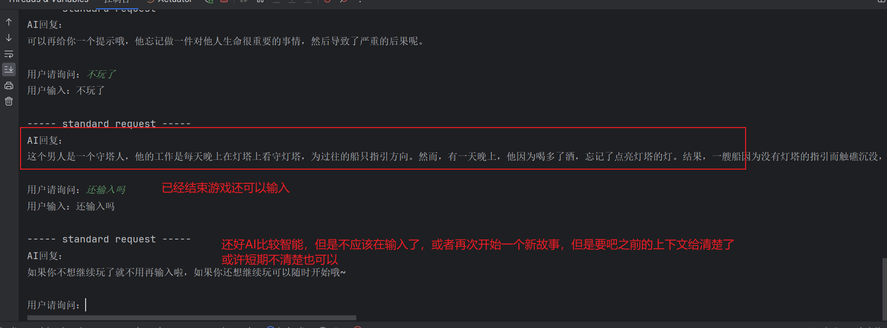

AI 还是太智能了，我并没有做出修改

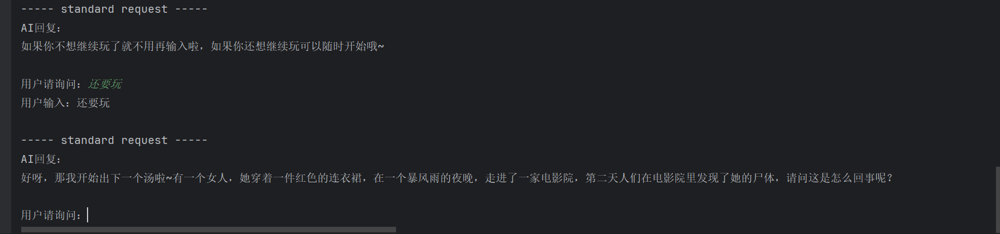

不过我要打断点，去查看现在的上下文内容

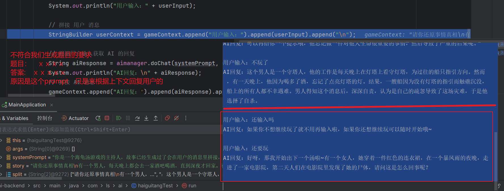

所以还是直接结束这次游戏、

```java
// 如果用户输入“退出”，结束循环 或者 AI 回复中有答案
if ("退出".equals(userInput) || aiResponse.contains("答案")) {
    break;
}
```

解决

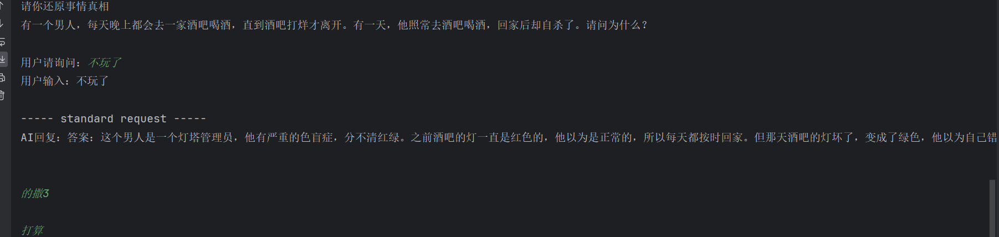