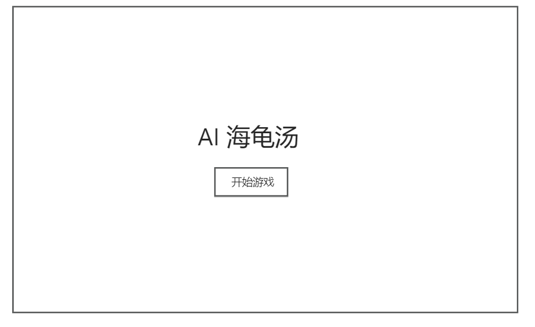
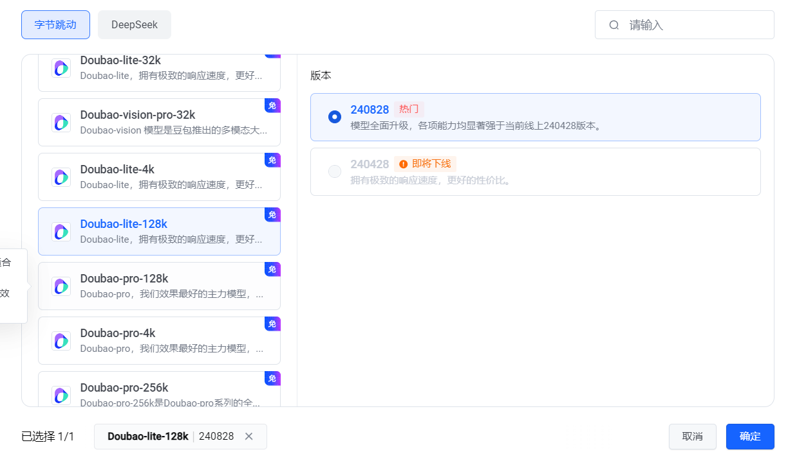

# AI 海龟汤

利用AI 生产海龟汤故事，和用户交互式的响应，让用户去解密。

海龟汤游戏介绍 [海龟汤概论 - 知乎](https://zhuanlan.zhihu.com/p/37072206)

利用AI 当作主持人，给出”汤面“，让用户去猜情景。AI 只能回复用户 `是 或者 不是`，10次提问后就给出“汤底”。

# 需求分析

* AI 生产“汤面和汤底” P0
* 用户和AI交互    P0
* 查看往期对话  P1
* 用户可以分享本次的海龟汤  P2

# 原型图




# 技术

* SpringBoot
* Mysql
* Mybatis
* DeepSeek
* Vue

# 核心功能梳理

1. 利用AI (主持人)生成海龟汤-> 输出给用户
2. 用户根据“汤面” ----> 询问问题或者给出答案
3. AI (主持人)对于用户的问题只能回答 是或者不是
4. 10条询问后还没有用户还没有猜出“汤底”，AI (主持人)给出“汤底”，并结束游戏
5. 或者用户猜出了答案，AI (主持人) 提示猜对了，并且给出“汤底”
6. 或者用户说出不想玩了，AI (主持人) 并且给出“汤底，并结束游戏”


# 项目初初始化

spring boot

mysql

mybaits

web

Knife4j


# 接入 AI

记录一下选择的模型



官方demo 引入测试


1. 引入依赖

```xml
       <!--        AI 接入 火山引擎 Deepseek https://www.volcengine.com/experience/ark-->
        <dependency>
            <groupId>com.volcengine</groupId>
            <artifactId>volcengine-java-sdk-ark-runtime</artifactId>
            <version>0.1.153</version>
        </dependency>
```

2. 创建apikey 并且使用官方demo 测试是否引入成功

```java
package com.ls.ai;

import com.volcengine.ark.runtime.model.completion.chat.ChatCompletionRequest;
import com.volcengine.ark.runtime.model.completion.chat.ChatMessage;
import com.volcengine.ark.runtime.model.completion.chat.ChatMessageRole;
import com.volcengine.ark.runtime.service.ArkService;
import okhttp3.ConnectionPool;
import okhttp3.Dispatcher;

import java.util.ArrayList;
import java.util.List;
import java.util.concurrent.TimeUnit;
public class AiTest {
    // 从环境变量中获取您的 API Key。此为默认方式，您可根据需要进行修改
       static String apiKey = "你的apikey";
    // 此为默认路径，您可根据业务所在地域进行配置
    static String baseUrl = "https://ark.cn-beijing.volces.com/api/v3";
    static ConnectionPool connectionPool = new ConnectionPool(5, 1, TimeUnit.SECONDS);
    static Dispatcher dispatcher = new Dispatcher();
    static ArkService service = ArkService.builder().dispatcher(dispatcher).connectionPool(connectionPool).baseUrl(baseUrl).apiKey(apiKey).build();

    public static void main(String[] args) {
        System.out.println("\n----- standard request -----");
        final List messages = new ArrayList<>();
        final ChatMessage systemMessage = ChatMessage.builder().role(ChatMessageRole.SYSTEM).content("你是人工智能助手.").build();
        final ChatMessage userMessage = ChatMessage.builder().role(ChatMessageRole.USER).content("常见的十字花科植物有哪些？").build();
        messages.add(systemMessage);
        messages.add(userMessage);

        ChatCompletionRequest chatCompletionRequest = ChatCompletionRequest.builder()
                // 指定您创建的方舟推理接入点 ID，此处已帮您修改为您的推理接入点 ID
                .model("doubao-lite-128k-240828")
                .messages(messages)
                .build();

        service.createChatCompletion(chatCompletionRequest).getChoices().forEach(choice -> System.out.println(choice.getMessage().getContent()));

        System.out.println("\n----- streaming request -----");
        final List streamMessages = new ArrayList<>();
        final ChatMessage streamSystemMessage = ChatMessage.builder().role(ChatMessageRole.SYSTEM).content("你是人工智能助手.").build();
        final ChatMessage streamUserMessage = ChatMessage.builder().role(ChatMessageRole.USER).content("常见的十字花科植物有哪些？").build();
        streamMessages.add(streamSystemMessage);
        streamMessages.add(streamUserMessage);

        ChatCompletionRequest streamChatCompletionRequest = ChatCompletionRequest.builder()
                // 指定您创建的方舟推理接入点 ID，此处已帮您修改为您的推理接入点 ID
                .model("doubao-lite-128k-240828")
                .messages(messages)
                .build();

        service.streamChatCompletion(streamChatCompletionRequest)
                .doOnError(Throwable::printStackTrace)
                .blockingForEach(
                        choice -> {
                            if (choice.getChoices().size() > 0) {
                                System.out.print(choice.getChoices().get(0).getMessage().getContent());
                            }
                        }
                );

        service.shutdownExecutor();
    }

}

```

测试： 如下引入成功


# 编写AI 工具类

上述官方demo的核心

1. 获取AI服务

```java
    static String apiKey = "你的apikey";
    // 此为默认路径，您可根据业务所在地域进行配置
    static String baseUrl = "https://ark.cn-beijing.volces.com/api/v3";
    static ConnectionPool connectionPool = new ConnectionPool(5, 1, TimeUnit.SECONDS);
    static Dispatcher dispatcher = new Dispatcher();
    static ArkService service = ArkService
            .builder().dispatcher(dispatcher)
            .connectionPool(connectionPool)
            .baseUrl(baseUrl)
            .apiKey(apiKey).build();
```

2. 构造消息

这一步应该我们用户去输入

```java
  // 构造消息
        final List messages = new ArrayList<>();
        final ChatMessage systemMessage = ChatMessage.builder().role(ChatMessageRole.SYSTEM).content("你是人工智能助手.").build();
        final ChatMessage userMessage = ChatMessage.builder().role(ChatMessageRole.USER).content("常见的十字花科植物有哪些？").build();
        messages.add(systemMessage);
        messages.add(userMessage);
```

3.构造请求（传入消息，并且指定模型）

```java
      ChatCompletionRequest chatCompletionRequest = ChatCompletionRequest.builder()
                // 指定您创建的方舟推理接入点 ID，此处已帮您修改为您的推理接入点 ID
                .model("doubao-lite-128k-240828")
                .messages(messages)
                .build();

```

4. 发起请求，并且获得结果

```java
    // 发起请求 并解析结果
        service.createChatCompletion(chatCompletionRequest)
                .getChoices()
                .forEach(choice -> System.out.println(choice.getMessage().getContent()));
```

了解上述，我们可以编写工具类，更好的调用AI服务（我们只关注，我们传入的参数）

> 编写AI 工具类

1.编写AI配置类 ---->定义一些我们ai服务的参数，获取到AI服务

```java
/**
 * AI 配置类
 */
@Configuration
@ConfigurationProperties(prefix = "ai")
@Data// 因为springboot 参数的注入是直接setter 方法的，所以要加@Data
public class Aiconfig {

    private  String apikey;

    static String baseUrl = "https://ark.cn-beijing.volces.com/api/v3";

    static ConnectionPool connectionPool = new ConnectionPool(5, 1, TimeUnit.SECONDS);
    static Dispatcher dispatcher = new Dispatcher();

    @Bean
    public ArkService getAIService() {
        return ArkService.builder().dispatcher(dispatcher)
                .connectionPool(connectionPool)
                .baseUrl(baseUrl)
                .apiKey(apikey).build();
    }
}

```

测试一下，有没有生效

搞了半小时，一直获取不到key。

获取不到key 的排查思路

1. 配置文件和java类apiKey 是否对应
2. 启动项目时是否指定环境

比如说我的apiKey在application-local.yaml文件，所以我启动项目(或者测试类)的时候也要指定启动的配置文件也就是环境。


3. 坚持配置类是否获取到配置文件中的信息。（一定要写set方法，我就是因为没有set方法，导致一直获取不到apikey）


测试通过


> AI工具类

上述我们已经拿到，AI服务了，为了更方便的使用，我们仅需要输入用户信息，而不关心其他。

```java
/**
 * Ai 工具类
 */
@Component
public class Aimanager {

    @Resource
    private ArkService aiService;


    /**
     * AI 默认模型 Doubao-lite-128k  240828
     */
    private  String Default_Model= "doubao-lite-128k-240828";


    /**
     * 用户输入
     * @param userPrompt
     * @return
     */
    public String doChat(String userPrompt) {
        System.out.println("\n----- standard request -----");

        // 构造消息
        final List<ChatMessage> messages = new ArrayList<>();
        final ChatMessage systemMessage = ChatMessage.builder().role(ChatMessageRole.SYSTEM).content("").build();
        final ChatMessage userMessage = ChatMessage.builder().role(ChatMessageRole.USER).content(userPrompt).build();
        messages.add(systemMessage);
        messages.add(userMessage);


        // 构造请求
        ChatCompletionRequest chatCompletionRequest = ChatCompletionRequest.builder()
                // 指定您创建的方舟推理接入点 ID，此处已帮您修改为您的推理接入点 ID
                .model(Default_Model)
                .messages(messages)
                .build();
//        发起请求 并解析结果
        List<ChatCompletionChoice> choices = aiService.createChatCompletion(chatCompletionRequest).getChoices();

        if (choices == null || choices.isEmpty()) {
            throw new RuntimeException("AI生成失败");
        }

        // 解析结果
        StringBuilder stringBuilder = new StringBuilder();
        choices.forEach(choice -> stringBuilder.append(choice.getMessage().getContent()).append("\n"));
        return stringBuilder.toString();

    }


    /**
     * 系统输入 用户输入
     * @param systemPrompt
     * @param userPrompt
     * @return
     */
    public String doChat(String systemPrompt,String userPrompt) {
        System.out.println("\n----- standard request -----");

        // 构造消息
        final List<ChatMessage> messages = new ArrayList<>();
        final ChatMessage systemMessage = ChatMessage.builder().role(ChatMessageRole.SYSTEM).content(systemPrompt).build();
        final ChatMessage userMessage = ChatMessage.builder().role(ChatMessageRole.USER).content(userPrompt).build();
        messages.add(systemMessage);
        messages.add(userMessage);


        // 构造请求
        ChatCompletionRequest chatCompletionRequest = ChatCompletionRequest.builder()
                // 指定您创建的方舟推理接入点 ID，此处已帮您修改为您的推理接入点 ID
                .model(Default_Model)
                .messages(messages)
                .build();
//        发起请求 并解析结果
        List<ChatCompletionChoice> choices = aiService.createChatCompletion(chatCompletionRequest).getChoices();

        if (choices == null || choices.isEmpty()) {
            throw new RuntimeException("AI生成失败");
        }

        // 解析结果
        StringBuilder stringBuilder = new StringBuilder();
        choices.forEach(choice -> stringBuilder.append(choice.getMessage().getContent()).append("\n"));
        return stringBuilder.toString();

    }


    /**
     * 系统输入、用户输入，用户指定模型
     * @param systemPrompt
     * @param userPrompt
     * @param AiModel
     * @return
     */
    public String doChat(String systemPrompt, String userPrompt,String AiModel){


        System.out.println("\n----- standard request -----");
        // 构造消息
        final List<ChatMessage> messages = new ArrayList<>();
        final ChatMessage systemMessage = ChatMessage.builder().role(ChatMessageRole.SYSTEM).content(systemPrompt).build();
        final ChatMessage userMessage = ChatMessage.builder().role(ChatMessageRole.USER).content(userPrompt).build();
        messages.add(systemMessage);
        messages.add(userMessage);


        // 封装请求
        ChatCompletionRequest chatCompletionRequest = ChatCompletionRequest.builder()
                // 指定您创建的方舟推理接入点 ID，此处已帮您修改为您的推理接入点 ID
                .model(AiModel)
                .messages(messages)
                .build();

        // 发起请求获取结果
        List<ChatCompletionChoice> choices = aiService.createChatCompletion(chatCompletionRequest).getChoices();

        if (choices == null || choices.isEmpty()) {
            throw  new RuntimeException("AI生成失败");
        }

        // 解析结果
        StringBuilder stringBuilder = new StringBuilder();
        choices.forEach(choice -> stringBuilder.append(choice.getMessage().getContent()).append("\n"));

        return stringBuilder.toString();
    }
}

```

测试

```java
@SpringBootTest
class AimanagerTest {


    @Resource
    private Aimanager aimanager;
    @Test
    void doChat() {
        String string = aimanager.doChat("你是谁");
        System.out.println("AI 回复 = " + string);
    }
}
```

没问题


